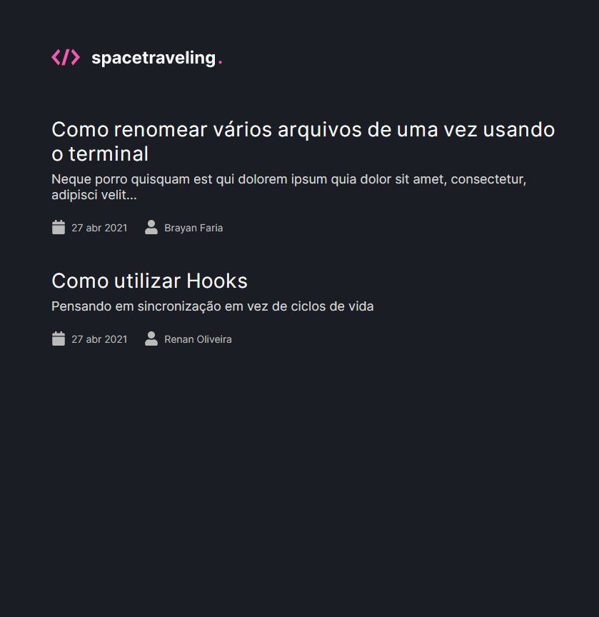
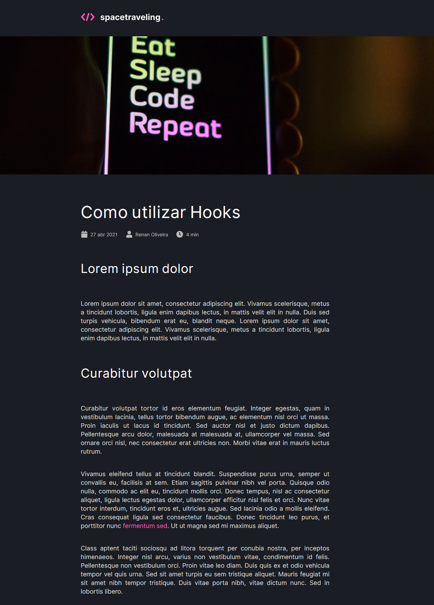
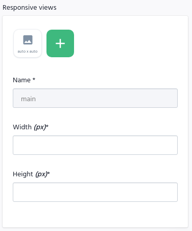

[](https://opensource.org/licenses/MIT)
[](https://choosealicense.com/licenses/mit)
[](https://nextjs.org/)
[](https://github.com/renanlido/goRestaurant/commits)
[](https://rocketseat.com.br)

<!--LOGO-->
<br/>
<div align="center">
    <a href="#">
        
    </a>

<br/><br/>
</div>

<!--THE RESULT-->

# <strong>O projeto!</strong>
<div>
  

  
<div>

<div>
    </br>
</div>

<!-- ABOUT THE PROJECT -->
# <strong>Sobre o Projeto</strong>
Neste projeto foi necessária a implementação do zero de um blog criado em Next.js e utilizando o CMS Prismic. Este é um projeto que foi desenvolvido no curso [Ignite da Rocketseat](https://rocketseat.com.br).
</br></br>
Todo o projeto é baseado em [Next.js](https://nextjs.org/) e [Typescript](https://www.typescriptlang.org/).

</br>

<!--INSTALATION-->

# Instalação

Para instalar e utilizar este projeto o processo é bem simples:
1. Após clonar o projeto utilize o comando:
    ```sh
    yarn
    ```
    Caso não tenha o yarn instalado, utilize o gerenciador de pacotes da sua preferência.

2. Utilize o comando abaixo para rodar o aplicativo.
    ```ssh
    yarn dev
    ```

3. Para ter posts no aplicativo é necessário criar uma conta no [Prismic](https://prismic.io/) e seguir a documentação de integração. O layout de criação dos posts no Prismic é o seguinte:
    - **slug**
        - Tipo: UID
        - Descrição: Identificador único amigável de cada post. Pode receber um valor manualmente ou é gerado automaticamente a partir do primeiro campo de texto preenchido. Esse campo vai ser utilizado na navegação do Next.
    - **title**
        - Tipo: Key Text
        - Descrição: Input de strings. Recebe valores manualmente. Esse campo será utilizado como título do Post.
    - **subtitle**
        - Tipo: Key Text
        - Descrição: Input de strings. Recebe valores manualmente. Esse campo será utilizado como subtítulo do Post.
    - **author**
        - Tipo: Key Text
        - Descrição: Input de strings. Recebe valores manualmente. Esse campo será utilizado como nome do autor do Post.
    - **banner**
        - Tipo: Image
        - Configurações do campo:

          

        - Descrição: Input de imagens. Recebe valores manualmente. Esse campo será utilizado como banner do Post.
    - **content**
        - Tipo: Group
        - Descrição: Grupo de campos repetíveis. Esse campo será utilizado como o conteúdo do Post. O conteúdo será dividido em seções com um campo `heading` e um campo `body`.
        - Campos internos:
            - **heading**
                - Tipo: Key Text
                - Descrição: Input de strings. Recebe valores manualmente. Esse campo será utilizado como título da seção do Post.
            - **body**
                - Tipo: Rich Text
                - Configurações do campo:

              

                - Descrição: Input de *rich text* (HTML). Recebe valores manualmente. Esse campo será utilizado como conteúdo da seção do Post. Perceba que nas configurações do campo, selecionamos algumas opções para que o seu texto tenha varias formatações (negrito, hyperlinks, listas, etc.).


</br>

<!-- LICENSE -->

# **Licença**

Distribuído sob a licença MIT. Veja `LICENSE` para mais informações.

<!-- CONTACT -->
</br>

# **Contato**

### Renan Oliveira - **renanlido@yahoo.com.br**

[Github](https://github.com/renanlido) - **https://github.com/renanlido** </br>
[Linkedin](https://www.linkedin.com/in/renanlido/) - **https://www.linkedin.com/in/renanlido/**

</br></br>
Obrigado por ter vindo 😊🤗
